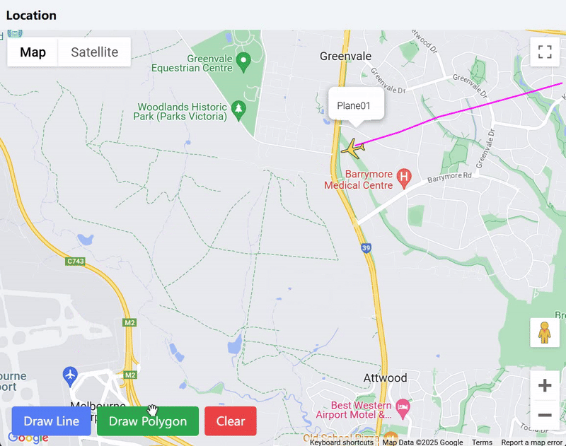

# Airplane Tracker

## Overview

Airplane Tracker is a React-based web application that integrates with the Google Maps API. It provides interactive map features including real-time airplane tracking functionality and drawing tools.

## Features

- **Interactive Map**: Displays a Google Map using the `@react-google-maps/api` library
- **Real-time Airplane Tracking**:
  - Displays aircraft icon, flight number, and flight path
  - Updates position and heading according to real-time data streaming by WebSocket
  - Uses WebSocket for real-time data streaming (mock implementation for development)
- **Drawing Tools**: Allows users to draw lines and polygons on the map

## Preview



## Getting Started

### Prerequisites

- Node.js (version specified in `.nvmrc`)
- npm (Node Package Manager)
- Google Maps API key with Maps JavaScript API enabled

### Installation

1. Clone the repository:
   ```bash
   git clone <repository-url> <project-name>
   cd <project-name>
   ```

2. Install dependencies:
   ```bash
   npm install
   ```

3. Set up environment variables:
   Create a `.env` file in the root directory with:
   ```
   REACT_APP_GOOGLE_MAPS_API_KEY=your_api_key_here
   REACT_APP_GOOGLE_MAPS_MAP_ID=your_map_id_here
   REACT_APP_USE_MOCK=true  # Use mock data for development
   ```

### Running the Application

- Start the development server:
  ```bash
  npm start
  ```

- Open your browser and navigate to `http://localhost:3000`.

### Building for Production

- To create a production build, run:
  ```bash
  npm run build
  ```

## Architecture

### Components

- **Map**: Main component handling Google Maps integration and drawing tools
- **FlightMarker**: Renders airplane icon, info window, and flight path
- **ActionButton**: Reusable button component for drawing controls

### Services

- **mockWebsocket.js**: Simulates WebSocket connection for development
- **flightService.js**: Real WebSocket implementation for production
- **index.js**: Service selector based on environment

## WebSocket Implementation

The application uses WebSocket for real-time flight data updates:

- Development: Uses mock WebSocket that simulates flight movement
- Production: Connects to real WebSocket server for live flight data
- Auto-reconnection on connection loss
- Cleanup on component unmount

## License

This project is licensed under the ISC License.

## Author

Gordon
